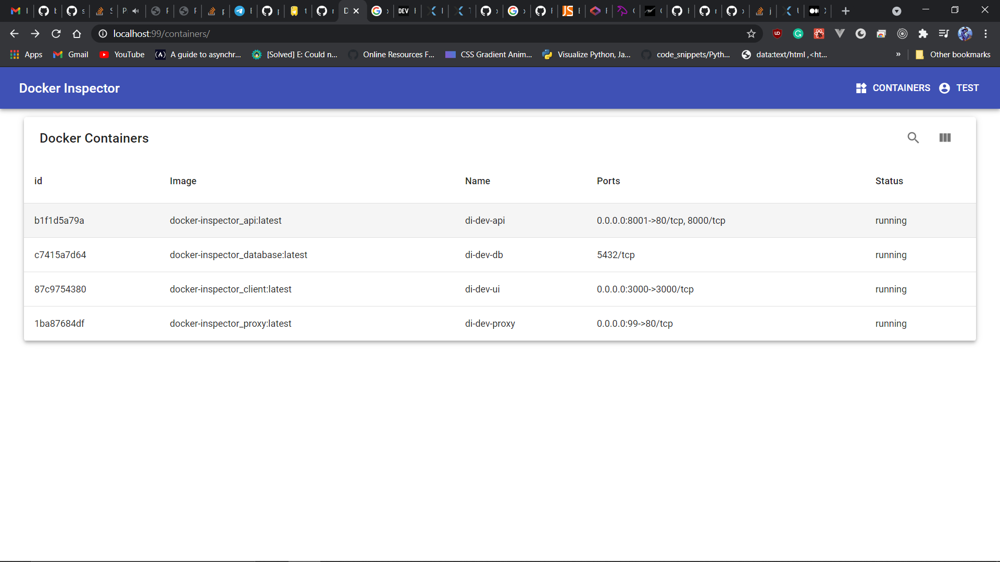
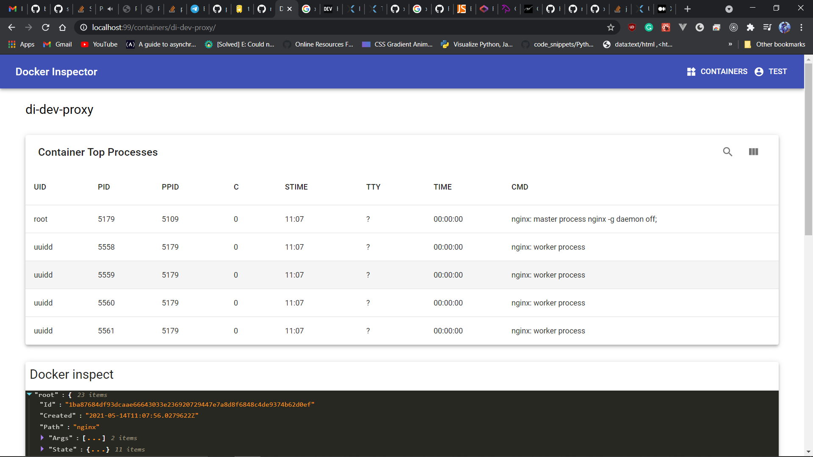

# Docker Inspector

Docker Inspector is an application to manage and monitor docker containers running on a machine.

Currently Available features are

- View list of containers running.
- View each container's running processes and logs.

## 



## Stack

- FAST API (with sqlalchemy as an **ORM**)
- Postgresql
- React
- Docker (for dev and prod)

## Development

```

docker-compose -f docker-compose.dev.yml up --build

```

## Production

```

docker-compose -f docker-compose.prod.yml up --build -d

```

```shell
# create users to access the UI
docker exec -it di-api python cli.py create-user-for-auth username user@example.com password

```

## Required Environment Variables

```
# filename .env

POSTGRES_USER=username
POSTGRES_PASSWORD=password
POSTGRES_DB=db_name
DBHOST=database
DBPORT=5432


```
